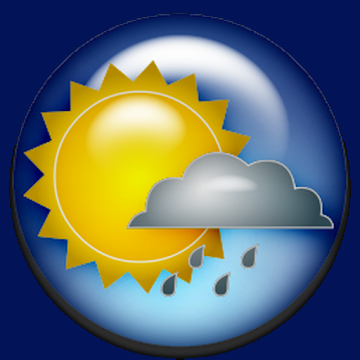

<div align="center">



# 🌤️ The Weather

**Gerçek zamanlı hava durumu takip uygulaması**

[](https://nodejs.org/)
[](https://expressjs.com/)
[](https://www.mongodb.com/)
[](https://developer.mozilla.org/en-US/docs/Web/JavaScript)
[](https://developer.mozilla.org/en-US/docs/Web/HTML)
[](https://developer.mozilla.org/en-US/docs/Web/CSS)

</div>

---

## 📋 İçindekiler

- [Proje Hakkında](#-proje-hakkında)
- [Özellikler](#-özellikler)
- [Ekran Görüntüleri](#-ekran-görüntüleri)
- [Teknoloji Stack](#-teknoloji-stack)
- [Kullanılan APIler](#-kullanılan-apiler)
- [Kurulum](#-kurulum)
- [Çevre Değişkenleri](#-çevre-değişkenleri)
- [Kullanım](#-kullanım)
- [Proje Yapısı](#-proje-yapısı)
- [Katkıda Bulunma](#-katkıda-bulunma)
- [İletişim](#-iletişim)

---

## 🌍 Proje Hakkında

**The Weather**, kullanıcılara anlık, saatlik ve haftalık hava durumu bilgilerini sunan tam kapsamlı bir web uygulamasıdır. **WeatherAPI** ve **OpenWeatherMap** entegrasyonuyla çalışan bu uygulama; şehir bazlı hava durumu sorgulama, konuma dayalı otomatik tespit, kullanıcı hesabı yönetimi ve ziyaret geçmişi gibi gelişmiş özellikler sunar.

Veri 15 dakikada bir otomatik olarak güncellenir ve MongoDB'ye önbelleğe alınır; böylece gereksiz API çağrılarının önüne geçilerek hem hız hem de maliyet optimizasyonu sağlanır.

---

## ✨ Özellikler

### 🌡️ Hava Durumu
- **Anlık Hava Durumu** — Sıcaklık, nem, rüzgar, basınç ve hissedilen sıcaklık
- **Saatlik Tahmin** — 24 saatlik saat saat detaylı hava durumu tablosu
- **Haftalık Tahmin** — 5 günlük min/max sıcaklık ve hava durumu özeti
- **Grafiksel Gösterim** — Chart.js ile saatlik çizgi grafiği ve haftalık bar grafiği
- **Türkiye Şehirleri** — 20+ Türk şehrine ait anlık hava durumu kartları
- **Türkiye Haritası** — Görsel Türkiye haritası üzerinde şehir bazlı sıcaklık gösterimi

### 📍 Konum
- **Otomatik Konum Tespiti** — Tarayıcı Geolocation API + OpenCage Geocoding ile kullanıcının bulunduğu şehri otomatik tespit eder
- **Manuel Şehir Arama** — Navbar üzerinden herhangi bir dünya şehri aranabilir

### 👤 Kullanıcı Yönetimi
- **Kayıt & Giriş** — Bcrypt ile şifreler güvenli biçimde hashlenerek saklanır
- **Profil Ekranı** — Kullanıcı adı ve e-posta bilgilerini görüntüleme
- **Ziyaret Geçmişi** — Son 5 arama kaydedilir; kullanıcı girişinde üst şeritteki şehirler otomatik olarak doldurulur

### 🌐 Çoklu Dil Desteği
- Türkçe, İngilizce, Almanca, Fransızca ve daha birçok dil için hazır arayüz yapısı

### ⚡ Performans
- **15 dakikalık önbellekleme** — MongoDB üzerinde veri şehir bazlı tutulur; taze veri olduğunda API'ye tekrar çağrı yapılmaz
- **Statik dosya sunumu** — Express ile icons, images ve HTML dosyaları doğrudan servis edilir

---

## 📸 Ekran Görüntüleri

| Anlık Hava Durumu | Saatlik Hava Durumu | Saatlik Grafik |
|:-----------------:|:-------------------:|:--------------:|
|  |  |  |

| Haftalık Hava Durumu | Haftalık Grafik | Türkiye Şehirleri |
|:--------------------:|:---------------:|:-----------------:|
|  |  |  |

---

## 🛠️ Teknoloji Stack

| Katman | Teknoloji |
|--------|-----------|
| **Backend** | Node.js, Express.js |
| **Veritabanı** | MongoDB, Mongoose |
| **Frontend** | Vanilla HTML5, CSS3, JavaScript |
| **Grafikler** | Chart.js |
| **Şifreleme** | bcrypt |
| **HTTP İstemcisi** | Axios |
| **Çevre Değişkenleri** | dotenv |
| **İkon Seti** | Font Awesome 6 |

---

## 🔌 Kullanılan APIler

| API | Kullanım Amacı |
|-----|----------------|
| [WeatherAPI](https://www.weatherapi.com/) | Anlık ve saatlik hava durumu verisi |
| [OpenWeatherMap](https://openweathermap.org/) | 5 günlük haftalık tahmin verisi |
| [OpenCage Geocoding](https://opencagedata.com/) | GPS koordinatlarından şehir adı çözümleme |

---

## 🚀 Kurulum

### Gereksinimler

- [Node.js](https://nodejs.org/) v18+
- [MongoDB](https://www.mongodb.com/) (yerel kurulum veya MongoDB Atlas)
- API anahtarları (WeatherAPI, OpenWeatherMap, OpenCage)

### Adımlar

```bash
# 1. Repoyu klonlayın
git clone https://github.com/AliKacarr/The-Weather.git
cd The-Weather

# 2. Bağımlılıkları yükleyin
npm install

# 3. .env dosyasını oluşturun (aşağıdaki bölüme bakın)

# 4. MongoDB'yi başlatın (yerel kurulumda)
mongod

# 5. Sunucuyu çalıştırın
node server.js
```

Tarayıcıda açın: [http://localhost:3000](http://localhost:3000)

---

## 🔐 Çevre Değişkenleri

Proje kök dizininde `.env` dosyası oluşturun:

```env
WEATHERAPI_API_KEY=your_weatherapi_key_here
OPENWEATHER_API_KEY=your_openweathermap_key_here
MONGO_URI=mongodb://localhost:27017/weatherDB
```

> **Not:** API anahtarlarınızı asla herkese açık repolara yüklemeyin. `.env` dosyasını `.gitignore`'a eklediğinizden emin olun.

---

## 📖 Kullanım

### Hava Durumu Sorgulama
1. Üst navbar'daki arama kutusuna bir şehir adı yazın
2. Enter tuşuna basın veya otomatik konuma izin verin
3. Anlık, saatlik ve haftalık veriler otomatik olarak yüklenir

### Kullanıcı Hesabı
1. **Kayıt Ol** butonuna tıklayarak hesap oluşturun
2. **Giriş Yap** ile oturum açın
3. Giriş yaptıktan sonra üst şeritte son 5 ziyaret ettiğiniz şehrin verileri otomatik görüntülenir

### API Endpoint'leri

| Endpoint | Yöntem | Açıklama |
|----------|--------|----------|
| `/update-weather?city={şehir}` | GET | Hava durumu verisini getirir (önbellek kontrolü dahil) |
| `/register` | POST | Yeni kullanıcı kaydı |
| `/login` | POST | Kullanıcı girişi |
| `/get-user-info?email={email}` | GET | Kullanıcı bilgilerini getirir |
| `/get-user-weather?email={email}` | GET | Kullanıcının ziyaret geçmişinin hava durumu |
| `/update-visited-cities` | POST | Ziyaret edilen şehirler listesini günceller |

---

## 📁 Proje Yapısı

```
The-Weather/
├── 📄 index.html              # Ana sayfa arayüzü
├── 📄 index2.html             # Yardımcı sayfa
├── 📄 server.js               # Express sunucusu & API yönlendirmeleri
├── 📄 script.js               # Ana frontend JavaScript mantığı
├── 📄 script2.js              # Yardımcı script
├── 📄 style.css               # Ana sayfa stilleri
├── 📄 style2.css              # Yardımcı stiller
├── 📄 turkiye_haritasi.html   # Türkiye hava haritası
├── 📄 turkiye_haritasi.css    # Harita stilleri
├── 📄 turkiye_haritasi.js     # Harita JavaScript mantığı
├── 📄 turkiye_cevresi.html    # Türkiye çevresi sayfası
├── 📄 turkiye_cevresi.css     # Çevre sayfası stilleri
├── 📄 package.json            # NPM bağımlılıkları
├── 📄 .env                    # Çevre değişkenleri (git'e eklenmemeli)
├── 📁 icons/                  # OpenWeatherMap hava ikonu seti (18 ikon)
├── 📁 images/                 # Arka planlar, logolar, sosyal medya ikonları
│   ├── Hakkımızda.html
│   ├── GizlilikPolitikası.html
│   └── ÇerezPolitikası.html
└── 📁 site_gorseller/         # Proje ekran görüntüleri
```

---

## 🤝 Katkıda Bulunma

Katkılarınızı memnuniyetle karşılıyoruz! Şu adımları izleyin:

1. Bu repoyu **fork** edin
2. Yeni bir **branch** oluşturun: `git checkout -b feature/yeni-ozellik`
3. Değişikliklerinizi **commit** edin: `git commit -m 'feat: yeni özellik eklendi'`
4. Branch'inizi **push** edin: `git push origin feature/yeni-ozellik`
5. Bir **Pull Request** açın

---

## 📬 İletişim

<div align="center">

**Ali Kaçar**

[](mailto:alikacar2361@gmail.com)
[](https://github.com/AliKacarr)
[](https://www.linkedin.com/in/alikacar)

</div>

---

<div align="center">

⭐ Bu projeyi beğendiyseniz yıldız vermeyi unutmayın!

**© 2024 The Weather — Ali Kaçar tarafından geliştirildi**

</div>
